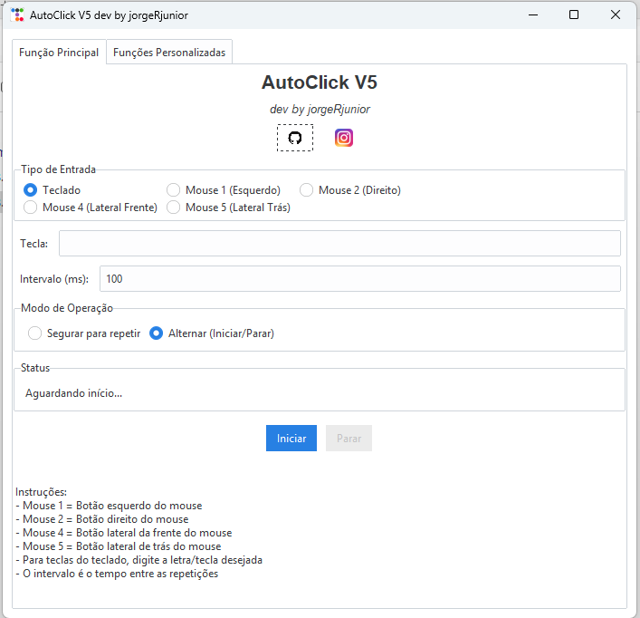
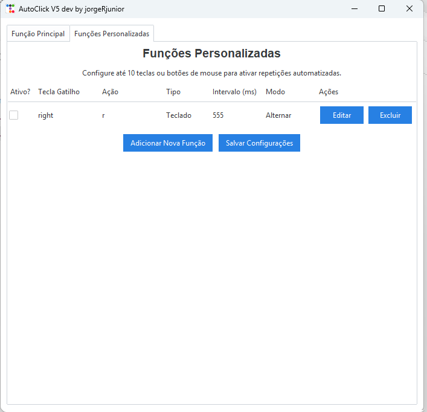
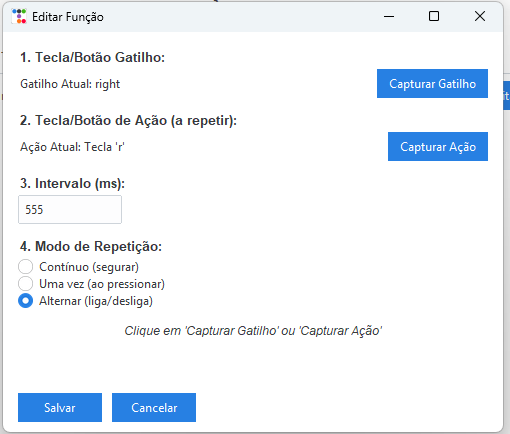

# AutoClick V7 by jorgeRjunior

A versatile autoclicker application with GUI built in Python using Tkinter and ttkbootstrap.

Um aplicativo de autoclicker versátil com interface gráfica construído em Python usando Tkinter e ttkbootstrap.



## What's New in V7 / Novidades na V7

### High-Precision Timer / Timer de Alta Precisão
- Uses `timeBeginPeriod(1)` + hybrid spin-wait for sub-millisecond accuracy
- Dynamic compensation measures action overhead and adjusts sleep time
- Configured 100ms now delivers ~99-101ms instead of 75-114ms

### Internationalization (i18n) / Internacionalização
- Full support for **English** (default) and **Português (BR)**
- Language selector in the top toolbar — switches all UI text instantly
- Language preference saved automatically

### Test Tab / Aba de Testes
- Real-time statistics: average, min/max, standard deviation, precision %
- Measurements log with color-coded status (green OK, yellow warning, red bad)
- Input lag suggestion: after 20+ measurements, suggests optimal interval configuration
- Uses your actual main tab settings to measure real timing accuracy

## Features / Funcionalidades

### Main Function / Função Principal
- Configure a global autoclick with trigger (keyboard or mouse), interval and operation mode (Hold or Toggle)
- Configure um autoclick global com gatilho (teclado ou mouse), intervalo e modo de operação (Segurar ou Alternar)

### Custom Functions / Funções Personalizadas
- Create up to 10 independent automation mappings
- Crie até 10 mapeamentos de automação independentes
    - Define specific triggers and actions (key or mouse button)
    - Configure individual intervals (random range min-max)
    - Choose between three repetition modes:
        - **Continuous / Contínuo:** Repeats while trigger is pressed
        - **Once / Uma Vez:** Executes action once per trigger press
        - **Toggle / Alternar:** First press starts, second press stops
    - Activate/deactivate each function individually
    - Settings saved automatically

### Test Tab / Aba de Testes
- Detects current configuration from Main tab automatically
- Start/Stop test with a single button
- Real-time stats updated every 250ms:
    - Configured interval, real average, min/max, std deviation, precision %
- Last 100 measurements displayed with color-coded deviation
- Smart suggestion panel recommends interval adjustments based on system overhead





## How to Use / Como Usar

1.  **Install dependencies / Instale as dependências:**
    ```bash
    pip install keyboard mouse ttkbootstrap Pillow requests
    ```
2.  **Run / Execute:**
    ```bash
    python main.py
    ```
3.  **Configure:**
    - Use the "Main Function" tab for quick setup / Use a aba "Função Principal" para configuração rápida
    - Use "Custom Functions" to create specific mappings / Use "Funções Personalizadas" para mapeamentos específicos
    - Use "Test" tab to verify timing accuracy / Use a aba "Testes" para verificar a precisão do timing
    - Switch language using the dropdown in the top-right corner / Troque o idioma usando o seletor no canto superior direito

## Dependencies / Dependências

- keyboard
- mouse
- ttkbootstrap
- Pillow (PIL)
- requests

## Build Executable / Gerar Executável

```bash
pyinstaller AutoClick_V6.spec --clean --noconfirm
```

## Download

Download the executable from / Baixe o executável em:
https://github.com/jorgeRjunior/autoclick/tree/main/dist

**NOTE: Run as administrator. / OBS: Execute como administrador.**
