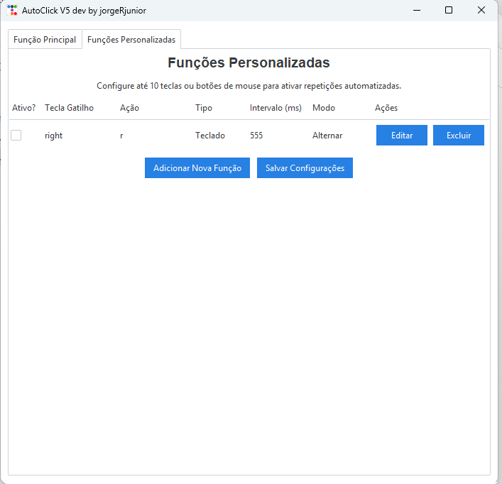

# AutoClick V5 by jorgeRjunior

Um aplicativo de autoclicker versátil com interface gráfica construído em Python usando Tkinter e ttkbootstrap.


## Funcionalidades

*   **Função Principal:** Configure rapidamente um autoclick global com gatilho (teclado ou mouse), intervalo e modo de operação (Segurar ou Alternar).
*   **Funções Personalizadas:** Crie até 10 mapeamentos de automação independentes.
    *   Defina gatilhos e ações específicas (tecla ou botão do mouse).
    *   Configure intervalos individuais.
    *   Escolha entre três modos de repetição:
        *   **Contínuo:** Repete enquanto o gatilho é pressionado.
        *   **Uma Vez:** Executa a ação uma única vez a cada pressionamento do gatilho.
        *   **Alternar:** Primeiro clique liga a repetição, segundo clique desliga.
    *   Ative/desative cada função individualmente.
    *   As configurações personalizadas são salvas automaticamente.
*   **Interface Moderna:** Utiliza `ttkbootstrap` para um visual mais agradável (tema 'cosmo' por padrão).




## Como Usar

1.  **Instale as dependências:**
    ```bash
    pip install keyboard mouse ttkbootstrap Pillow requests
    ```
    *(O script tenta instalar `keyboard`, `mouse` e `ttkbootstrap` automaticamente se não encontrados, mas é recomendado instalar manualmente).*
2.  **Execute o script:**
    ```bash
    python main.py
    ```
3.  **Configure:**
    *   Use a aba "Função Principal" para uma configuração rápida.
    *   Use a aba "Funções Personalizadas" para criar mapeamentos específicos. Clique em "Adicionar Nova Função", configure o gatilho, ação, intervalo e modo, e salve. Ative a função usando o checkbox.

## Dependências

*   keyboard
*   mouse
*   ttkbootstrap
*   Pillow (PIL)
*   requests

## Para gerar um arquivo executavel
* pyinstaller --onefile --windowed --name "AutoClick V5" --hidden-import keyboard --hidden-import mouse --hidden-import ttkbootstrap main.py
OBS: Execute como administrador.
